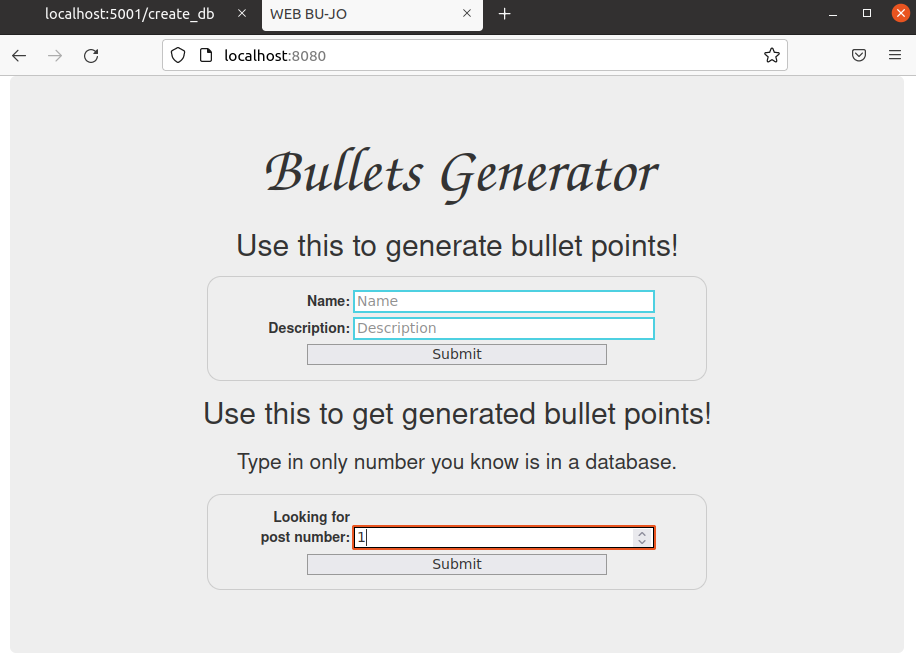
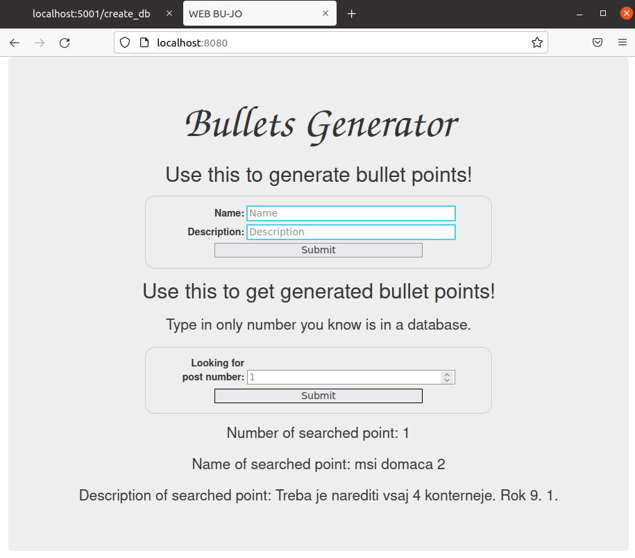

# MSI Docker domača naloga
## Splošno o nalogi

Naredila sem spletno aplikacijo v python flask, ki je razdeljena na dva dela. En del je za prejemanje post requestov od html strani za pisanje in prejemanje napisanega, drugi del je, zaradi manjše možnosti napake, za kreiranje in počiščenje baze.  
Aplikaciji imata bazo MySQL.  
Del za pisanje in prejemanje napisanega se izvaja na statični spletni strani, ki je hostana na nginx strežniku. 
Prav tako je multi-stage build z go aplikacijo, ki jo lahko vidiš na [localhost:5002/text_tukaj](http://localhost:5002/text_tukaj). Namesto `text_tukaj` vpiši karkoli. 

# Uporaba
Preko git clone ali Download zip dobiš potrebne datoteke. Premakni se v ustezno mapo ter zaženi spodnji ukaz, ki bo buildal in zagnal vse potrebno.

```bash
cd msi_docker
docker-compose -f docker-compose.yml up --build
```
V brskalniku greš na [localhost:5000/](http://localhost:5000/) ali [localhost:5001/](http://localhost:5001/), kjer so splošna navodila.

Obvezno moraš pred prvo uporabo iti na [localhost:5001/create_db](http://localhost:5001/create_db), to je kot neka registracija. Vse nadaljo delo poteka na [localhost:8080](http://localhost:8080).

## Kreiranje baze
Greš na [localhost:5001/create_db](http://localhost:5001/create_db).  

 

## Splošna navodila
Greš na [localhost:5000/](http://localhost:5000/) ali [localhost:5001/](http://localhost:5001/).    

  
 

## Spletna stran
Greš na [localhost:8080](http://localhost:8080).  

  

Kjer lahko vpisuješ vse kar bi drugače lahko pozabil. To je tvoja online beležka. Na koncu klikni `Submit`.  

  
  

To kar si si zapisal lahko najdeš po njegovem id-ju oziroma njegovi zaporedni številki. 

  
  
  
  

## Go stran
Če greš na [localhost:5002/monkeys and tigers](http://localhost:5002/monkeys_and_tigers). Namesto `monkeys and tigers` lahko vpišeš karkoli. 

  


# Potencialni problemi s katerimi se lahko srečaš
Če delaš v virtualki ali pa daješ svoj računalnik v spanje, preden ponovno zaženeš ukaz `docker-compose -f docker-compose.yml up --build` zaženi `sudo service docker restart`, saj tako ponovno dns resolution znotra docker-ja pravilno dela. 